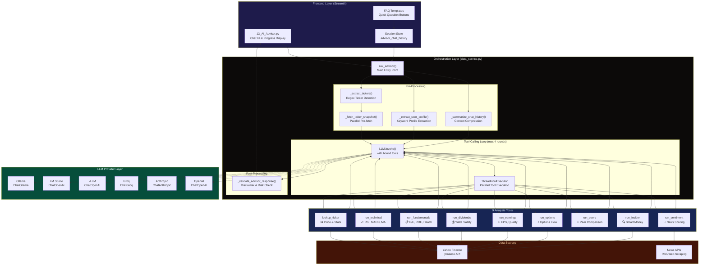
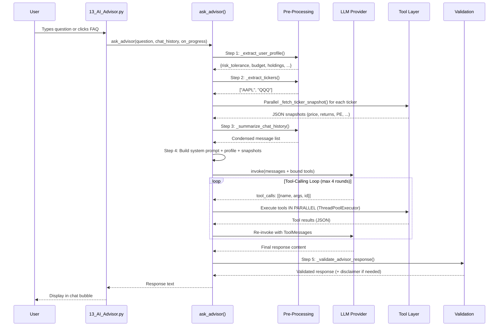
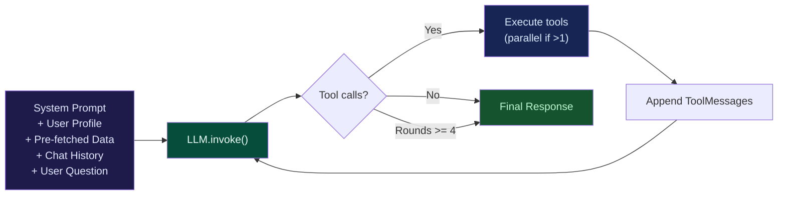
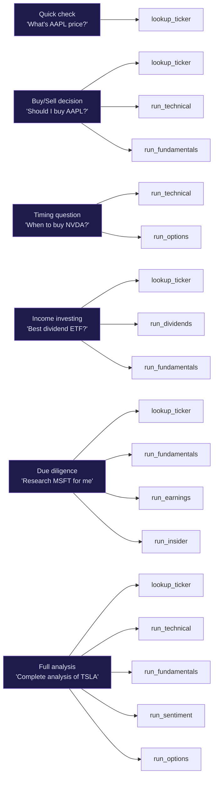
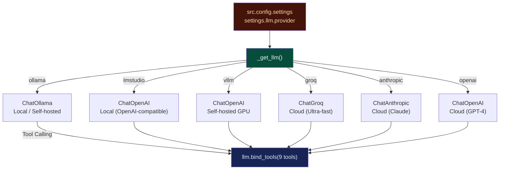
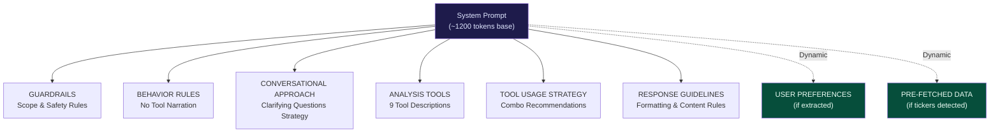
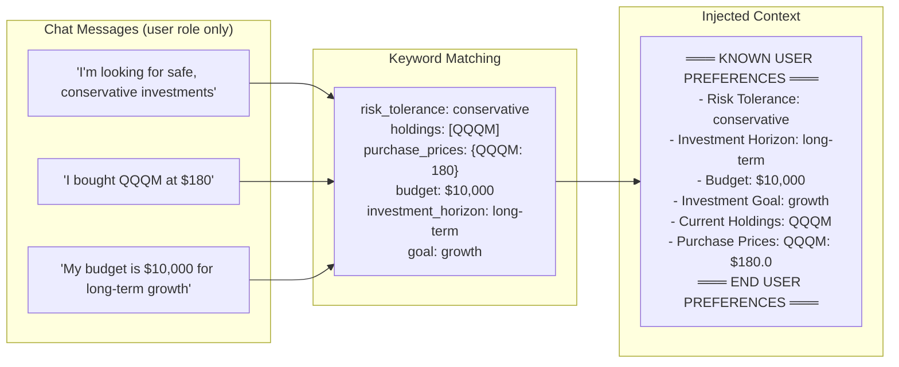
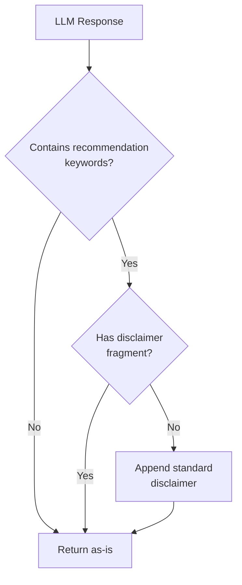
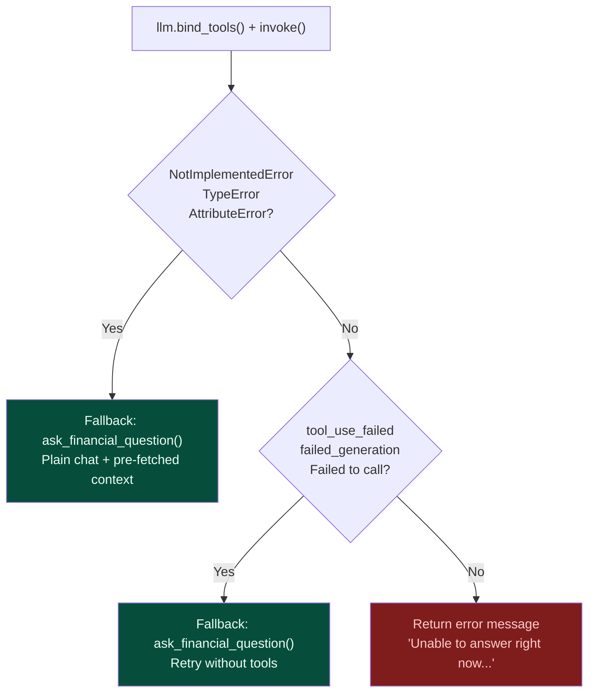

# AI Financial Advisor — Technical Documentation

> **Feature**: AI Advisor (Page 13)  
> **Version**: 2.0 — Enhanced with context injection, parallel execution, and 9 analysis tools  
> **Files**: [13_AI_Advisor.py](file:///Users/gopalsaini/Documents/Source/ai-agents-playgrounds/financial-research-analyst-agent/frontend/pages/13_AI_Advisor.py), [data_service.py](file:///Users/gopalsaini/Documents/Source/ai-agents-playgrounds/financial-research-analyst-agent/frontend/utils/data_service.py)

---

## Table of Contents

1. [Overview](#overview)
2. [System Architecture](#system-architecture)
3. [Processing Pipeline](#processing-pipeline)
4. [Analysis Tools](#analysis-tools)
5. [LLM Integration](#llm-integration)
6. [System Prompt Engineering](#system-prompt-engineering)
7. [Pre-Processing Layer](#pre-processing-layer)
8. [Post-Processing Layer](#post-processing-layer)
9. [Error Handling & Fallback](#error-handling--fallback)
10. [UI Layer](#ui-layer)
11. [Configuration Reference](#configuration-reference)
12. [File Reference](#file-reference)

---

## Overview

The AI Financial Advisor is an interactive chat interface built with **Streamlit** that provides personalized financial guidance about stocks, ETFs, dividends, portfolio strategy, and market themes. It uses a **single LLM agent with tool-calling** (ReAct-style loop) to dynamically fetch and analyze real-time market data before generating responses.

### Key Design Principles

- **On-demand data fetching** — Only queries the data sources relevant to the user's question
- **Context-aware** — Pre-fetches ticker data and tracks user preferences across the conversation
- **Multi-provider** — Supports 6 different LLM backends (local and cloud)
- **Safety-first** — Enforced guardrails prevent crypto, penny stock, and off-topic responses
- **Graceful degradation** — Falls back to plain chat if tool-calling fails

---

## System Architecture

### High-Level Architecture



### Request-Response Data Flow



---

## Processing Pipeline

The advisor processes every query through a **5-step pipeline**:

### Step 1: User Profile Extraction

| What | How | Speed |
|---|---|---|
| Extract risk tolerance | Keyword matching: "conservative", "aggressive", "moderate" | <1ms |
| Extract investment horizon | Keyword matching: "long-term", "short-term" | <1ms |
| Extract budget | Regex: `$[\d,]+` patterns | <1ms |
| Extract investment goal | Keyword matching: "growth", "income", "preservation" | <1ms |
| Extract holdings | Regex: "I bought/own/have X" patterns | <1ms |
| Extract purchase prices | Regex: "X at $Y" or "X @ $Y" patterns | <1ms |

> [!NOTE]
> Profile extraction uses **pure regex and keyword matching** — no LLM call required. This keeps it fast and deterministic.

**Source**: [_extract_user_profile()](file:///Users/gopalsaini/Documents/Source/ai-agents-playgrounds/financial-research-analyst-agent/frontend/utils/data_service.py#L586-L656)

### Step 2: Ticker Pre-Fetch

```
User: "Compare QQQ vs VOO for long-term growth"
                    ↓
    _extract_tickers() → ["QQQ", "VOO"]
                    ↓
    ThreadPoolExecutor(max_workers=5)
     ├── _fetch_ticker_snapshot("QQQ")  ──→ JSON snapshot
     └── _fetch_ticker_snapshot("VOO")  ──→ JSON snapshot
                    ↓
    Injected as ═══ PRE-FETCHED MARKET DATA ═══ in system prompt
```

**Source**: [_extract_tickers()](file:///Users/gopalsaini/Documents/Source/ai-agents-playgrounds/financial-research-analyst-agent/frontend/utils/data_service.py#L534-L562), [_fetch_ticker_snapshot()](file:///Users/gopalsaini/Documents/Source/ai-agents-playgrounds/financial-research-analyst-agent/frontend/utils/data_service.py#L735-L789)

### Step 3: Chat Summarization

```
If conversation_length > 6 messages:
    older_messages → Truncated to 200 chars each, joined as "[CONVERSATION SUMMARY]"
    recent_6_messages → Kept verbatim
```

**Source**: [_summarize_chat_history()](file:///Users/gopalsaini/Documents/Source/ai-agents-playgrounds/financial-research-analyst-agent/frontend/utils/data_service.py#L696-L729)

### Step 4: LLM Tool-Calling Loop



- **Max rounds**: 4 (prevents infinite loops)
- **Parallel execution**: `ThreadPoolExecutor(max_workers=5)` when multiple tools are called in the same round
- **Single tool**: Runs directly without thread pool overhead

**Source**: [ask_advisor()](file:///Users/gopalsaini/Documents/Source/ai-agents-playgrounds/financial-research-analyst-agent/frontend/utils/data_service.py#L1009-L1281)

### Step 5: Response Validation

Checks the final LLM response and auto-fixes issues:

| Check | Action |
|---|---|
| Contains recommendation keywords (buy, sell, hold, etc.) but no disclaimer | Appends standard disclaimer |
| Empty response | Returns as-is |

**Source**: [_validate_advisor_response()](file:///Users/gopalsaini/Documents/Source/ai-agents-playgrounds/financial-research-analyst-agent/frontend/utils/data_service.py#L1293-L1319)

---

## Analysis Tools

### Tool Reference Table

| # | Tool Name | Icon | Underlying Module | Data Source | TTL Cache | Key Outputs |
|---|---|---|---|---|---|---|
| 1 | [lookup_ticker](file:///Users/gopalsaini/Documents/Source/ai-agents-playgrounds/financial-research-analyst-agent/frontend/utils/data_service.py#1102-1110) | 📊 | `yfinance` (direct) | Yahoo Finance | None | Price, returns (1m/3m/YTD/1y), P/E, forward P/E, PEG, beta, dividend yield, analyst target, recommendation |
| 2 | [run_technical](file:///Users/gopalsaini/Documents/Source/ai-agents-playgrounds/financial-research-analyst-agent/frontend/utils/data_service.py#1111-1120) | 📈 | `src.tools.technical_indicators` | Yahoo Finance | 300s | RSI, MACD, SMA/EMA, Bollinger Bands, support/resistance, chart patterns |
| 3 | [run_fundamentals](file:///Users/gopalsaini/Documents/Source/ai-agents-playgrounds/financial-research-analyst-agent/frontend/utils/data_service.py#1121-1130) | 📋 | `src.tools.financial_metrics` | Yahoo Finance | 1800s | P/E, P/B, EV/EBITDA, ROE, ROA, profit margins, debt ratios, financial health score |
| 4 | [run_dividends](file:///Users/gopalsaini/Documents/Source/ai-agents-playgrounds/financial-research-analyst-agent/frontend/utils/data_service.py#1131-1140) | 💰 | `src.tools.dividend_analyzer` | Yahoo Finance | 1800s | Yield, safety score, payout ratio, growth history, Dividend King/Aristocrat classification |
| 5 | [run_earnings](file:///Users/gopalsaini/Documents/Source/ai-agents-playgrounds/financial-research-analyst-agent/frontend/utils/data_service.py#1141-1150) | 📑 | `src.tools.earnings_data` | Yahoo Finance | 1800s | EPS actual vs estimates, beat/miss patterns, quarterly trends, earnings quality score |
| 6 | [run_sentiment](file:///Users/gopalsaini/Documents/Source/ai-agents-playgrounds/financial-research-analyst-agent/frontend/utils/data_service.py#1151-1160) | 📰 | `src.tools.news_impact` | News APIs | 600s | Aggregated sentiment score, article count, topic extraction |
| 7 | [run_peers](file:///Users/gopalsaini/Documents/Source/ai-agents-playgrounds/financial-research-analyst-agent/frontend/utils/data_service.py#1161-1170) | 🔄 | `src.tools.peer_comparison` | Yahoo Finance | 1800s | Sector peer comparison on valuation, performance, profitability |
| 8 | [run_options](file:///Users/gopalsaini/Documents/Source/ai-agents-playgrounds/financial-research-analyst-agent/frontend/utils/data_service.py#1171-1181) | ⚡ | `src.tools.options_analyzer` | Yahoo Finance | None | Put/call ratio, implied volatility (volume-weighted), IV skew, max pain, unusual activity (top 5), options sentiment score (0-100) |
| 9 | [run_insider](file:///Users/gopalsaini/Documents/Source/ai-agents-playgrounds/financial-research-analyst-agent/frontend/utils/data_service.py#1182-1193) | 🔍 | `src.tools.insider_activity` | Yahoo Finance | None | Form 4 insider transactions (90d), cluster buying detection, institutional ownership, top holders, smart money score (0-100) |

### Tool Usage Strategy

The system prompt instructs the LLM to combine tools based on question type:



### Ticker Snapshot Schema

Each [_fetch_ticker_snapshot()](file:///Users/gopalsaini/Documents/Source/ai-agents-playgrounds/financial-research-analyst-agent/frontend/utils/data_service.py#735-790) call returns:

```json
{
  "symbol": "AAPL",
  "name": "Apple Inc.",
  "price": 178.52,
  "sector": "Technology",
  "industry": "Consumer Electronics",
  "pe_ratio": 28.5,
  "forward_pe": 26.1,
  "peg_ratio": 2.3,
  "dividend_yield": 0.56,
  "market_cap": 2780000000000,
  "52w_high": 199.62,
  "52w_low": 155.98,
  "beta": 1.24,
  "returns": {
    "1m": 3.21,
    "3m": 8.45,
    "ytd": 12.67,
    "1y": 22.34
  },
  "analyst_target": 195.00,
  "recommendation": "buy"
}
```

> [!TIP]
> Fields with `None` values are automatically stripped before serialization to reduce token usage in the LLM context.

---

## LLM Integration

### Multi-Provider Architecture

The advisor supports **6 LLM providers** via LangChain's chat model abstraction. The provider is configured in `src/config/settings` and cached per Streamlit session via `@st.cache_resource`.



| Provider | LangChain Class | Tool-Calling Support | Notes |
|---|---|---|---|
| **Ollama** | `ChatOllama` | ✅ (model-dependent) | Local, free, requires model download |
| **LM Studio** | `ChatOpenAI` | ✅ (model-dependent) | Local, OpenAI-compatible API |
| **vLLM** | `ChatOpenAI` | ✅ | Self-hosted, GPU-accelerated |
| **Groq** | `ChatGroq` | ⚠️ (partial) | Some models fail tool-calling format |
| **Anthropic** | `ChatAnthropic` | ✅ | Claude models, excellent tool-calling |
| **OpenAI** | `ChatOpenAI` | ✅ | GPT-4/GPT-4o, best tool-calling support |

> [!WARNING]
> If a provider does not support tool-calling (raises `NotImplementedError`, `TypeError`, or `AttributeError`), the advisor automatically falls back to plain chat mode with pre-fetched context injected as a static context string.

**Source**: [_get_llm()](file:///Users/gopalsaini/Documents/Source/ai-agents-playgrounds/financial-research-analyst-agent/frontend/utils/data_service.py#L356-L421)

---

## System Prompt Engineering

The system prompt is structured into **7 sections**, each serving a specific role:



### Guardrails

| Category | Rule |
|---|---|
| **Scope** | Stocks, ETFs, bonds, portfolio strategy, dividends, earnings, themes, options flow, insider activity |
| **Refused topics** | Crypto/NFTs, penny stocks/OTC, insider trading, tax/legal advice, non-financial topics |
| **Safety** | No return guarantees, no single-stock concentration, leveraged ETF warnings required, risk always acknowledged |
| **Disclaimer** | Every recommendation must end with the standard disclaimer |
| **Behavior** | Never mention tool names, never narrate internal processes |

### Conversational Strategy

The advisor uses a **two-phase approach**:

1. **Phase 1 — Clarification**: On the first message about a topic, ask 2–3 short clarifying questions
2. **Phase 2 — Recommendation**: After user responds, synthesize data + preferences into a specific, data-backed recommendation

**Exception**: If user preferences are already known (from the profile tracker), skip questions about those already-answered preferences.

**Source**: [_ADVISOR_SYSTEM_PROMPT](file:///Users/gopalsaini/Documents/Source/ai-agents-playgrounds/financial-research-analyst-agent/frontend/utils/data_service.py#L895-L1006)

---

## Pre-Processing Layer

### Ticker Extraction

Uses a multi-strategy regex approach with a **false-positive filter** of ~100 common English words that also happen to be valid ticker symbols.

```
Input: "I bought QQQM at $180, should I hold or sell? Compare with VOO."
                                    ↓
Strategy 1: $TICKER notation       → (none found)
Strategy 2: Uppercase 2-5 chars    → ["QQQM", "VOO"]
Filter: _COMMON_WORD_TICKERS       → removes false positives
                                    ↓
Output: ["QQQM", "VOO"]
```

> [!NOTE]
> The filter list includes financial terms (BUY, SELL, HOLD, PUT, CALL, ETF, AI, SEC, IPO) and common short words (IT, ALL, FOR, ARE, etc.) to prevent false positives.

**Source**: [_extract_tickers()](file:///Users/gopalsaini/Documents/Source/ai-agents-playgrounds/financial-research-analyst-agent/frontend/utils/data_service.py#L534-L562)

### User Profile Extraction

Tracks 8 preference dimensions across the entire conversation:



**Source**: [_extract_user_profile()](file:///Users/gopalsaini/Documents/Source/ai-agents-playgrounds/financial-research-analyst-agent/frontend/utils/data_service.py#L586-L656), [_format_user_profile()](file:///Users/gopalsaini/Documents/Source/ai-agents-playgrounds/financial-research-analyst-agent/frontend/utils/data_service.py#L659-L691)

---

## Post-Processing Layer

### Response Validation



**Recommendation keywords monitored**: `recommend`, `suggest`, `consider`, [buy](file:///Users/gopalsaini/Documents/Source/ai-agents-playgrounds/financial-research-analyst-agent/src/tools/insider_activity.py#242-283), `sell`, [hold](file:///Users/gopalsaini/Documents/Source/ai-agents-playgrounds/financial-research-analyst-agent/src/tools/insider_activity.py#342-375), `allocate`, `invest`, `position`, `portfolio`

**Disclaimer fragments checked**: `not personalized`, `financial advice`, `licensed financial advisor`

**Source**: [_validate_advisor_response()](file:///Users/gopalsaini/Documents/Source/ai-agents-playgrounds/financial-research-analyst-agent/frontend/utils/data_service.py#L1293-L1319)

---

## Error Handling & Fallback



| Error Scenario | Handling |
|---|---|
| Provider doesn't support tool-calling | Falls back to [ask_financial_question()](file:///Users/gopalsaini/Documents/Source/ai-agents-playgrounds/financial-research-analyst-agent/frontend/utils/data_service.py#437-512) with pre-fetched context |
| Tool-calling format error (Groq) | Detects via error message keywords, retries without tools |
| Tool execution error | Returns `"Tool error: {details}"` as ToolMessage, LLM handles gracefully |
| LLM provider offline | Returns user-friendly error with details |
| Yahoo Finance API failure | Individual tool returns `{"error": "..."}`, LLM notes data unavailability |

> [!IMPORTANT]
> In fallback mode, the advisor still benefits from **pre-fetched ticker data** and **user profile context**, which are injected as static context into the fallback's system prompt. This ensures reasonable quality even without tool-calling.

---

## UI Layer

### Page Structure

```
13_AI_Advisor.py
├── Page Config (title, icon, layout)
├── CSS injection + session init + sidebar
├── Header (gradient title + subtitle)
├── FAQ Templates (8 quick-start questions in 2-column grid)
├── Chat History Display (scrollable message bubbles)
├── Chat Input (text input + FAQ click handler)
└── Analysis Pipeline
    ├── Status Widget (expandable, shows live progress steps)
    ├── ask_advisor() invocation
    └── Response display (markdown)
```

### Progress Display

Each step in the pipeline reports progress via the [on_progress](file:///Users/gopalsaini/Documents/Source/ai-agents-playgrounds/financial-research-analyst-agent/frontend/pages/13_AI_Advisor.py#134-138) callback with step-specific icons:

| Step Key | Icon | Example Label |
|---|---|---|
| `profiling` | 👤 | Understanding your preferences... |
| `prefetch` | 📡 | Fetching live data for AAPL, QQQ... |
| `analyzing` | 🧠 | Analyzing your question... |
| [lookup](file:///Users/gopalsaini/Documents/Source/ai-agents-playgrounds/financial-research-analyst-agent/frontend/utils/data_service.py#1102-1110) | 📊 | Fetching AAPL market data... |
| [technical](file:///Users/gopalsaini/Documents/Source/ai-agents-playgrounds/financial-research-analyst-agent/frontend/utils/data_service.py#1111-1120) | 📈 | Running technical analysis on AAPL (RSI, MACD, Moving Averages)... |
| [fundamentals](file:///Users/gopalsaini/Documents/Source/ai-agents-playgrounds/financial-research-analyst-agent/frontend/utils/data_service.py#1121-1130) | 📋 | Running fundamental analysis on AAPL (Valuation, Profitability, Health)... |
| [dividends](file:///Users/gopalsaini/Documents/Source/ai-agents-playgrounds/financial-research-analyst-agent/frontend/utils/data_service.py#1131-1140) | 💰 | Analyzing AAPL dividend profile (Yield, Safety, Growth History)... |
| [earnings](file:///Users/gopalsaini/Documents/Source/ai-agents-playgrounds/financial-research-analyst-agent/frontend/utils/data_service.py#1141-1150) | 📑 | Analyzing AAPL quarterly earnings (EPS Surprises, Trends, Quality)... |
| [sentiment](file:///Users/gopalsaini/Documents/Source/ai-agents-playgrounds/financial-research-analyst-agent/frontend/utils/data_service.py#1151-1160) | 📰 | Analyzing AAPL news sentiment... |
| [peers](file:///Users/gopalsaini/Documents/Source/ai-agents-playgrounds/financial-research-analyst-agent/frontend/utils/data_service.py#1161-1170) | 🔄 | Comparing AAPL against sector peers... |
| [options](file:///Users/gopalsaini/Documents/Source/ai-agents-playgrounds/financial-research-analyst-agent/frontend/utils/data_service.py#1171-1181) | ⚡ | Analyzing AAPL options flow (Put/Call, IV, Max Pain)... |
| [insider](file:///Users/gopalsaini/Documents/Source/ai-agents-playgrounds/financial-research-analyst-agent/frontend/utils/data_service.py#1182-1193) | 🔍 | Tracking AAPL insider & institutional activity (Smart Money)... |
| `synthesizing` | ✨ | Synthesizing insights & preparing recommendation... |
| `fallback` | 🔁 | Using conversational mode... / Retrying without tool calling... |

**Source**: [13_AI_Advisor.py progress handlers](file:///Users/gopalsaini/Documents/Source/ai-agents-playgrounds/financial-research-analyst-agent/frontend/pages/13_AI_Advisor.py#L117-L137)

---

## Configuration Reference

### LLM Settings (`src/config/settings`)

| Setting | Description |
|---|---|
| `llm.provider` | LLM provider: `ollama`, `lmstudio`, `vllm`, `groq`, `anthropic`, `openai` |
| `llm.model` | Model name for OpenAI/Anthropic |
| `llm.ollama_model` | Ollama model name |
| `llm.ollama_base_url` | Ollama API endpoint |
| `llm.groq_model` | Groq model name |
| `llm.groq_api_key` | Groq API key |
| `llm.openai_api_key` | OpenAI API key |
| `llm.anthropic_api_key` | Anthropic API key |
| `llm.max_tokens` | Max tokens for response |

### Internal Constants

| Constant | Value | Description |
|---|---|---|
| Temperature | `0.7` | Conversational temperature for all providers |
| Max tool-calling rounds | `4` | Prevent infinite tool loops |
| Pre-fetch max tickers | `5` | Cap parallel pre-fetch requests |
| Thread pool workers | `5` | Max concurrent tool executions |
| Chat summarization threshold | `6` messages | Messages beyond this are summarized |
| Message truncation length | `200` chars | Max chars per summarized message |

---

## File Reference

| File | Lines | Purpose |
|---|---|---|
| [13_AI_Advisor.py](file:///Users/gopalsaini/Documents/Source/ai-agents-playgrounds/financial-research-analyst-agent/frontend/pages/13_AI_Advisor.py) | 150 | Streamlit page: chat UI, FAQ templates, progress display |
| [data_service.py](file:///Users/gopalsaini/Documents/Source/ai-agents-playgrounds/financial-research-analyst-agent/frontend/utils/data_service.py) | 1319 | Data service: LLM factory, all tools, orchestrator, pre/post-processing |
| [technical_indicators.py](file:///Users/gopalsaini/Documents/Source/ai-agents-playgrounds/financial-research-analyst-agent/src/tools/technical_indicators.py) | — | RSI, MACD, Moving Averages, Bollinger Bands, pattern detection |
| [financial_metrics.py](file:///Users/gopalsaini/Documents/Source/ai-agents-playgrounds/financial-research-analyst-agent/src/tools/financial_metrics.py) | — | Valuation ratios, profitability ratios, financial health analysis |
| [dividend_analyzer.py](file:///Users/gopalsaini/Documents/Source/ai-agents-playgrounds/financial-research-analyst-agent/src/tools/dividend_analyzer.py) | — | Dividend yield, safety score, growth history, classification |
| [earnings_data.py](file:///Users/gopalsaini/Documents/Source/ai-agents-playgrounds/financial-research-analyst-agent/src/tools/earnings_data.py) | — | EPS analysis, beat/miss patterns, earnings quality |
| [news_impact.py](file:///Users/gopalsaini/Documents/Source/ai-agents-playgrounds/financial-research-analyst-agent/src/tools/news_impact.py) | — | News sentiment aggregation and scoring |
| [peer_comparison.py](file:///Users/gopalsaini/Documents/Source/ai-agents-playgrounds/financial-research-analyst-agent/src/tools/peer_comparison.py) | — | Peer comparison (async), valuation & performance ranking |
| [options_analyzer.py](file:///Users/gopalsaini/Documents/Source/ai-agents-playgrounds/financial-research-analyst-agent/src/tools/options_analyzer.py) | 420 | Put/call ratio, IV, max pain, unusual activity, options sentiment |
| [insider_activity.py](file:///Users/gopalsaini/Documents/Source/ai-agents-playgrounds/financial-research-analyst-agent/src/tools/insider_activity.py) | 484 | Form 4 parsing, cluster buying, institutional holdings, smart money score |
